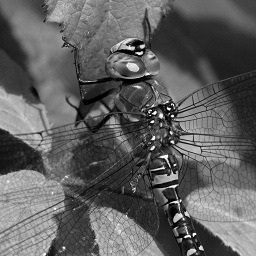

## Let's just say we're doing some DIP learning.

### What is it?
An assignment in digital image processing course aiming to de-blur an image that have been taken as a burst (of similar images) by a shaky hand. 

### The input image

### Questions:
1. (wet part) what is the size of the PSF? should we normalize to it?
2. (dry - 3) what is the action of the camera means? is it integration over exposure time? fourier transform? 

#### Authors
Nevo Agmon [@nagmo](https://github.com/nagmo) 
Danny Priymak [@daisp](https://github.com/daisp)
