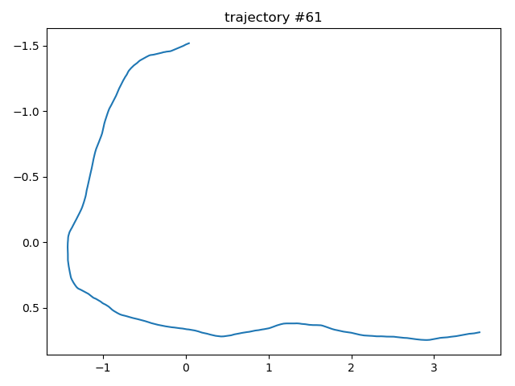
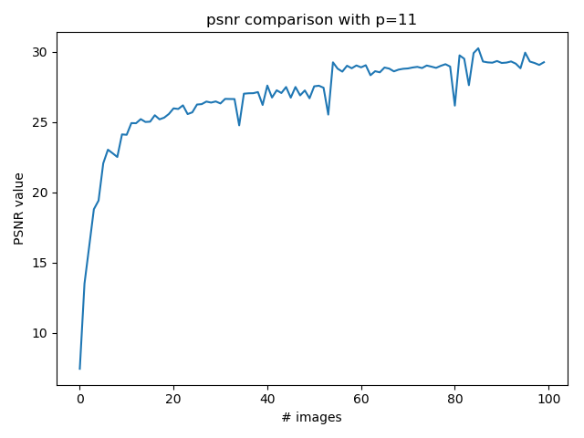
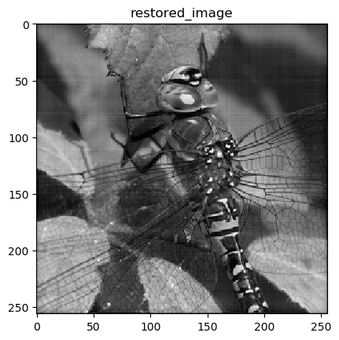

## Let's just say we're doing some DIP learning.

### What is it?
An assignment in digital image processing course aiming to de-blur an image that have been taken as a burst (of similar images) by a shaky hand. 

### The input image

### How is it work?
For each trajectory we generate a PSF matrix that represents the convolution kernel the movement of the hand caused.

An example of a trajectory is: 

From a trajectory we generate the PSF and then convolve the image with each PSF matrix. 
Then we iterate over each blurred image and create a weighted sum of its frequencies and preform inverse Fourier transform to get the restored image.

Here is a plot of the PSNR of the restored image in relation to the number of blurred input images taken: 

Here is an eample of the restored image: 

 
#### Authors
Nevo Agmon [@nagmo](https://github.com/nagmo) 
Danny Priymak [@daisp](https://github.com/daisp)
